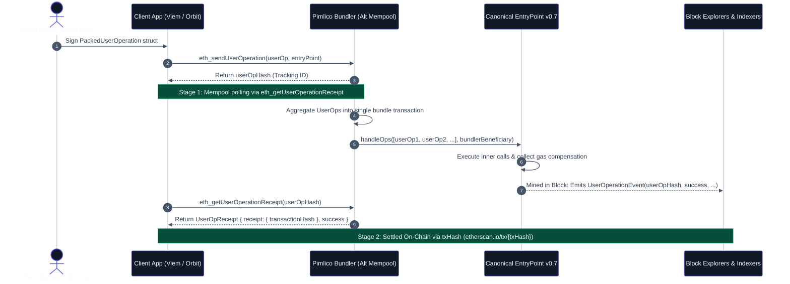

# Demystifying ERC-4337: Sovereign Account Abstraction with Viem, Solady, and Pimlico (Avoiding Vendor Lock-In)

Account Abstraction (ERC-4337) fundamentally transforms how users interact with the Ethereum Virtual Machine (EVM): replacing fragile seed phrases with smart contract authorization, enabling sponsored transactions via paymasters, and executing atomic multi-call batches.

However, the ecosystem's initial rush toward adoption introduced widespread confusion between **convenience** and **sovereignty**. Many teams adopted monolithic Wallet-as-a-Service (WaaS) suites under the assumption that Account Abstraction requires proprietary relayer networks and vendor-locked clouds.

This guide provides an exhaustive architectural audit of ERC-4337 v0.7. It deconstructs the alternative mempool mechanics, details the dual-identifier lifecycle (`userOpHash` vs `txHash`), analyzes the trade-offs between assembly-optimized accounts (Solady) and modular architectures (ERC-7579), and contrasts **canonical, framework-neutral Viem implementations** with **TUWA's modular open-source toolkit (`@tuwaio/orbit-evm`, `@tuwaio/pulsar-evm`)** and optional cloud indexing.

---

## 1. The Account Abstraction Spectrum: Signer vs. Account

The foundational concept of ERC-4337 is the strict decoupling of the **Signer** from the **Smart Account**:

```
┌────────────────────────────────────────────────────────────────────────┐
│                   Decoupled Account Abstraction Model                  │
├───────────────────────────────────┬────────────────────────────────────┤
│ Signer (Cryptographic Authority)  │ Smart Account (On-Chain Execution) │
├───────────────────────────────────┼────────────────────────────────────┤
│ • Local Secp256k1 EOA Key         │ • Solady ERC-4337 (Single Owner)   │
│ • Hardware Wallet (Ledger/Trezor) │ • ERC-7579 Modular Account (Kernel)│
│ • SSS / MPC Key Share (Non-cust.) │ • Atomic Multi-Call Batching       │
│ • WebAuthn P-256 (via Verifier)   │ • Canonical EntryPoint v0.7        │
│ • Sole Job: Sign arbitrary bytes  │ • Asset Custody & Nonce Validation │
└───────────────────────────────────┴────────────────────────────────────┘
```

- **The Signer (Key Management):** An entity that holds cryptographic credentials and generates signatures over arbitrary byte arrays. In self-custodial setups, this is an EOA private key or hardware wallet. In embedded WaaS setups (such as Privy or Dynamic), this is typically implemented using **2-of-3 Shamir's Secret Sharing (SSS)** combined with **Trusted Execution Environments (AWS Nitro Enclaves / TEE)** with client-side key export capabilities.
- **The Account (Execution Engine):** A smart contract deployed on-chain that validates incoming signatures (`validateUserOp`), verifies 2D nonce sequences, holds assets, and executes batched contract calls against target protocols.

### Deconstructing the WaaS Trade-Off

Embedded wallet providers (Privy, Dynamic) are often mislabeled as custodial exchanges. In reality, modern WaaS architectures use non-custodial threshold cryptography where the provider never possesses the full private key on disk.

The authentic trade-off of WaaS is **operational infrastructure dependency**:

1. If the provider's authorization APIs or TEE enclaves suffer downtime, client-side signature generation is temporarily blocked until users manually reconstruct and export their shares.
2. Under ERC-4337, however, developers are not forced into an all-or-nothing choice: a WaaS-generated key can simply serve as **one of several disposable signers** on a sovereign smart account, allowing seamless key rotation without migrating assets or changing contract addresses.

---

## 2. The Two-Phase Lifecycle: `userOpHash` vs `txHash`

Standard EVM frontends interact with standard transactions synchronously: serialize a transaction, sign it with an EOA, submit it to a node via `eth_sendRawTransaction`, and poll for the resulting `txHash`.

ERC-4337 introduces the **Alternative Mempool**, fundamentally splitting execution into two distinct stages:



### The Dual-Identifier Dilemma

Frontend architectures must treat `userOpHash` and `txHash` as complementary identifiers operating at different stages of execution:

1. **`userOpHash` (Client Intent ID):**
   - **Definition:** A `keccak256` hash of the serialized `PackedUserOperation` parameters, the `EntryPoint` contract address (`0x0000000071727de22e5e9d8baf0edac6f37da032`), and the target `chainId`.
   - **Scope:** It lives in the memory pool of ERC-4337 bundlers until bundled.
   - **Explorer Realities:** Public block explorers (Etherscan, Blockscout) index blocks retrospectively. Querying `https://etherscan.io/tx/{userOpHash}` while the operation is pending in the bundler's mempool returns a 404 / "Not Found" error. During the alternative mempool phase, standard queries to `eth_getUserOperationReceipt` return `null`. Frontend state machines poll this Bundler RPC endpoint until the bundle is mined and the receipt is generated. To inspect the raw UserOperation parameters while it is still pending in the mempool, applications query `eth_getUserOperationByHash` or use bundler telemetry (such as Pimlico Mempool Explorer).

2. **`txHash` (On-Chain Settlement ID):**
   - **Definition:** The transaction hash of the Ethereum transaction broadcast by the **Bundler's EOA** calling `EntryPoint.handleOps()`.
   - **Scope:** Exists on the canonical EVM blockchain. A single `txHash` can contain dozens of UserOperations from completely independent users.

### Three Production Failure Modes of Naive Frontends

When engineering teams attempt to integrate ERC-4337 using standard EOA transaction workflows, frontends fail across three specific failure modes:

#### 1. RPC Node Polling vs. Bundler Mempool Mismatch

Naive frontends take the `userOpHash` returned by `sendUserOperation` and pass it to standard node RPCs via `publicClient.waitForTransactionReceipt({ hash: userOpHash })`. Because the UserOp lives in the alternative mempool and not the execution node's transaction pool, the RPC node returns `TransactionNotFoundError`. Applications must poll `eth_getUserOperationReceipt` specifically on a Bundler RPC endpoint.

#### 2. Bundle Calldata Obfuscation

Once bundled, the outer `txHash` points to `EntryPoint.handleOps()`. If the frontend discards the `userOpHash` and only preserves the outer `txHash`, users inspecting their history on block explorers are presented with an aggregated batch containing other users' contract interactions, obscuring their own transfer amounts, recipient addresses, and isolated gas costs.

#### 3. Silent Execution Reverts inside `EntryPoint.handleOps`

In standard transactions, `receipt.status === 1` guarantees that all internal calls succeeded. In ERC-4337, bundlers require financial protection against gas exhaustion caused by user contract errors. If an inner UserOp reverts (e.g., Uniswap slippage exceeded or insufficient token balance):

- **The outer bundle transaction still succeeds (`receipt.status === 1`)**.
- The bundler collects gas compensation from the smart account or paymaster deposit.
- The EntryPoint contract emits a `UserOperationEvent` with `success == false` and a `UserOperationRevertReason` event containing the revert data.

> [!CAUTION]
> A standard transaction receipt monitor checking `receipt.status === 1` will report **"Success"**, falsely confirming an operation that completely reverted on-chain! Production systems must explicitly verify `receipt.success === true` from `eth_getUserOperationReceipt`.

---

## 3. Smart Account Architectures: Solady vs. ERC-7579 Modular Accounts

When selecting an on-chain account architecture, developers face a direct trade-off between **gas efficiency** and **extensibility**:

```
┌────────────────────────────────────────────────────────────────────────┐
│                     Smart Account Architectural Matrix                 │
├───────────────────────────────────┬────────────────────────────────────┤
│ Solady ERC4337.sol (Minimalist)   │ ERC-7579 (Modular Standard)        │
├───────────────────────────────────┼────────────────────────────────────┤
│ • Pure Yul Assembly implementation│ • Modular Proxy (Kernel v3, Safe)  │
│ • Lowest possible deployment gas  │ • Dynamic Module Installation      │
│ • Minimal runtime overhead        │ • Native Session Keys & Subscriptions│
│ • Strict Single-Owner (secp256k1) │ • Multi-Validator (WebAuthn, ECDSA)│
│ • Immutably fixed logic           │ • Social Recovery & Spending Limits│
└───────────────────────────────────┴────────────────────────────────────┘
```

### The Cryptographic Reality of Solady & Passkeys

A common misconception is that Solady's base contracts natively support WebAuthn / TouchID Passkeys:

- Solady's `ERC4337.sol` and `ERC4337Factory.sol` are strictly designed for **Single EOA Owners** represented by a 20-byte Ethereum address (`address owner`). The factory's deterministic salt packs the 160-bit owner address into the high bits (`ownSalt`).
- WebAuthn Passkeys utilize the **NIST P-256 (secp256r1)** elliptic curve, producing a 64-byte uncompressed $(X, Y)$ public key—not a 20-byte address.
- Validating P-256 signatures in the EVM requires either an **EIP-7212 precompile** (currently active only on select L2s) or computationally expensive software verification (Solady's `P256.sol`, consuming ~250k+ gas).

**Engineering Recommendation:**

- Use **Solady** when building lean smart accounts controlled by an EOA (browser wallet or hardware key) where gas minimization during account deployment is the primary objective.
- Use **ERC-7579 Modular Accounts** (e.g., ZeroDev Kernel v3, Biconomy Nexus, or Safe) when your dApp requires WebAuthn Passkeys, session keys, multi-sig recovery, or dynamic security policies.

---

## 4. Implementation: Canonical Viem AA vs. TUWA Open-Source Stack

Developers can implement sovereign ERC-4337 flows using either canonical, unbundled Viem primitives or TUWA's ergonomic open-source toolkit.

### 4.1 Implementation A: Canonical Native Viem (`viem/account-abstraction`)

This implementation relies exclusively on standard `viem` packages with zero additional framework dependencies:

```typescript
// src/services/canonicalSmartAccount.ts
import { http, createPublicClient, encodeFunctionData, parseUnits, erc20Abi, pad, type Hex } from 'viem';
import { sepolia } from 'viem/chains';
import {
  createBundlerClient,
  createPaymasterClient,
  toSoladySmartAccount,
  type BundlerClient,
  type ToSoladySmartAccountReturnType,
} from 'viem/account-abstraction';
import { toAccount } from 'viem/accounts';
import type { WalletClient, HttpTransport } from 'viem';

/**
 * Initializes a Solady smart account and binds a canonical Viem Bundler client
 * with native Pimlico paymaster sponsorship.
 */
export async function initializeCanonicalAccount(walletClient: WalletClient) {
  const apiKey = process.env.NEXT_PUBLIC_PIMLICO_API_KEY;
  if (!apiKey) throw new Error('Missing NEXT_PUBLIC_PIMLICO_API_KEY');

  const bundlerRpcUrl = `https://api.pimlico.io/v2/sepolia/rpc?apikey=${apiKey}`;

  const publicClient = createPublicClient({
    chain: sepolia,
    transport: http(),
  });

  if (!walletClient.account) {
    throw new Error('WalletClient must have an active account.');
  }

  const ownerAccount = walletClient.account;

  // 1. Wrap the JSON-RPC account to ensure signing delegation methods are available
  const owner = toAccount({
    address: ownerAccount.address,
    async signMessage({ message }) {
      return walletClient.signMessage({ account: ownerAccount, message });
    },
    async signTransaction(tx) {
      return walletClient.signTransaction({ account: ownerAccount, ...tx } as any);
    },
    async signTypedData(typedData) {
      return walletClient.signTypedData({ account: ownerAccount, ...typedData } as any);
    },
  });

  // 2. Compute Solady factory-compliant deterministic salt:
  // Solady's ERC4337Factory packs the owner address directly into the top 160 bits of ownSalt (extracted via shr(96, ownSalt)).
  const salt = pad(ownerAccount.address, { dir: 'right', size: 32 });

  // 3. Create Solady Smart Account with explicit owner delegation and salt
  const account = await toSoladySmartAccount({
    client: publicClient,
    owner,
    salt,
  });

  // 4. Instantiate Viem Paymaster Client configured for Pimlico
  const paymasterClient = createPaymasterClient({
    transport: http(bundlerRpcUrl),
  });

  // 5. Instantiate canonical Viem Bundler Client with paymaster sponsorship
  const bundlerClient = createBundlerClient({
    account,
    client: publicClient,
    transport: http(bundlerRpcUrl),
    paymaster: paymasterClient,
    paymasterContext: {
      sponsorshipPolicyId: 'sp_my_policy_id', // ERC-7677 / Pimlico sponsorship policy
    },
  });

  return { account, bundlerClient, publicClient, paymasterClient };
}

/**
 * Dispatches a UserOp, tracks the mempool stage, and verifies internal execution success.
 */
export async function executeCanonicalTransfer({
  bundlerClient,
  account,
  tokenAddress,
  recipient,
  amount,
}: {
  bundlerClient: BundlerClient<HttpTransport>;
  account: ToSoladySmartAccountReturnType;
  tokenAddress: `0x${string}`;
  recipient: `0x${string}`;
  amount: string;
}) {
  const callData = encodeFunctionData({
    abi: erc20Abi,
    functionName: 'transfer',
    args: [recipient, parseUnits(amount, 18)],
  });

  // 1. Dispatch UserOperation to Pimlico Bundler
  const userOpHash = await bundlerClient.sendUserOperation({
    account,
    calls: [{ to: tokenAddress, value: 0n, data: callData }],
  });

  // 2. Poll eth_getUserOperationReceipt on Bundler RPC (Stage 1 tracking)
  const userOpReceipt = await bundlerClient.waitForUserOperationReceipt({
    hash: userOpHash,
    pollingInterval: 1_500,
    timeout: 60_000,
  });

  // 3. Prevent silent execution revert: verify inner success flag
  if (!userOpReceipt.success) {
    const reason = userOpReceipt.reason || 'UserOperation reverted inside EntryPoint.handleOps';
    throw new Error(`Execution reverted: ${reason}`);
  }

  // 4. Capture canonical settlement hash for Stage 2
  const settledTxHash = userOpReceipt.receipt.transactionHash;
  const explorerUrl = `https://sepolia.etherscan.io/tx/${settledTxHash}`;

  return { userOpHash, settledTxHash, explorerUrl };
}
```

> [!TIP]
> **Solady Assembly Mechanics & Salt Safety:**  
> In Solady's `ERC4337Factory.sol`, the owner address is packed directly into the most significant 160 bits (upper 20 bytes) of `bytes32 ownSalt` and extracted at the assembly level using `shr(96, ownSalt)`. The owner address is not passed as an independent function argument. If you pass an arbitrary unpadded salt without the owner address in the upper 20 bytes, the transaction will **not revert**—the factory will deploy the account, but will initialize ownership to a random, unusable address extracted from the top bytes of the salt, permanently locking the smart account and any deposited assets! `pad(ownerAccount.address, { dir: 'right', size: 32 })` guarantees that the top 160 bits properly identify the intended owner.

---

### 4.2 Implementation B: Ergonomic TUWA Stack (`@tuwaio/orbit-evm` & `@tuwaio/pulsar-evm`)

TUWA's core libraries are **100% open-source (MIT/Apache-2)** modular packages designed to eliminate the boilerplate of client caching, salt padding, Wagmi synchronization, and reactive multi-phase state management:

```
┌────────────────────────────────────────────────────────────────────────┐
│                     The Open-Source TUWA Stack                         │
├────────────────────────────────────────────────────────────────────────┤
│ • @tuwaio/orbit-evm   : Bundler/Paymaster caching, Solady salt padding │
│ • @tuwaio/pulsar-core : Headless, framework-agnostic transaction FSM   │
│ • @tuwaio/pulsar-evm  : Native Two-Stage tracker (Mempool ➔ Settlement)│
│ • @tuwaio/nova-uikit  : Unstyled / Tailwind presentation layer         │
└────────────────────────────────────────────────────────────────────────┘
```

#### Step 1: Orchestrating the Smart Account with Orbit EVM

`@tuwaio/orbit-evm` automatically calculates Solady-compliant salt padding (`pad(ownerAddress, { dir: 'right', size: 32 })`) and caches Bundler and Paymaster instances in memory:

```typescript
// src/services/orbitSmartAccount.ts
import { createPimlicoSmartAccountClient } from '@tuwaio/orbit-evm';
import { sepolia } from 'viem/chains';
import type { Config } from '@wagmi/core';

export async function getOrbitSmartAccountClient(wagmiConfig: Config) {
  // Resolves walletClient from Wagmi, attaches cached Pimlico Paymaster,
  // and configures EntryPoint v0.7 compliant Bundler client
  const { account, bundlerClient, publicClient, paymasterClient } = await createPimlicoSmartAccountClient({
    chain: sepolia,
    wagmiConfig,
    apiKey: process.env.NEXT_PUBLIC_PIMLICO_API_KEY,
    sponsor: true,
  });

  return { account, bundlerClient, publicClient, paymasterClient };
}
```

#### Step 2: Reactive Two-Stage Tracking with Pulsar Engine

> [!NOTE]
> **Partial Setup Notice & Central Architecture:**
> The code below demonstrates a **partial configuration focused specifically on transaction execution and action dispatching**.
> For complete application setup—including centralized store initialization (`createPulsarStore`), cross-chain adapters, persistence, and pre-flight validation hooks—refer to the comprehensive [Pulsar Engine Documentation](https://pulsar.docs.tuwa.io/).

In standard UI code, managing transitions between `userOpHash` and `txHash` across page reloads requires dozens of lines of local storage glue code. `@tuwaio/pulsar-evm` provides a native **Two-Stage Tracking Pipeline**.

Production implementations in [Cosmos Playground](https://github.com/TuwaIO/cosmos-playground/tree/main/examples/nextjs-tuwa-quasar) cleanly separate the headless execution logic from the reactive React component dispatch:

##### Part A: Pure Transaction Action (`incrementPimlico.ts`)

The action function remains completely headless, pure, and decoupled from UI state. It initializes the smart client via Orbit, encodes the calldata, and dispatches the UserOperation to the bundler:

```typescript
// src/transactions/evm/incrementPimlico.ts
import { createPimlicoSmartAccountClient } from '@tuwaio/orbit-evm';
import { type Config } from '@wagmi/core';
import { encodeFunctionData, type Hex } from 'viem';
import { sepolia } from 'viem/chains';

import { CounterAbi } from '@/abis/CounterAbi';
import { COUNTER_ADDRESS } from '@/constants';

/**
 * Executes a counter increment via an ERC-4337 UserOperation using a Pimlico bundler.
 * Returns the raw userOpHash for lifecycle tracking.
 */
export async function incrementPimlico({ wagmiConfig }: { wagmiConfig?: Config }): Promise<Hex | undefined> {
  if (!wagmiConfig) return undefined;

  // 1. Initialize Solady Smart Account & Bundler client via Orbit EVM
  const { account, bundlerClient } = await createPimlicoSmartAccountClient({
    chain: sepolia,
    wagmiConfig,
    apiKey: process.env.NEXT_PUBLIC_PIMLICO_API_KEY,
    rpcUrl: process.env.NEXT_PUBLIC_ALCHEMY_KEY
      ? `https://eth-sepolia.g.alchemy.com/v2/${process.env.NEXT_PUBLIC_ALCHEMY_KEY}`
      : undefined,
  });

  // 2. Encode contract calldata
  const data = encodeFunctionData({
    abi: CounterAbi,
    functionName: 'increment',
  });

  // 3. Dispatch UserOperation to alternative mempool and return userOpHash
  return bundlerClient.sendUserOperation({
    account,
    calls: [
      {
        to: COUNTER_ADDRESS,
        data,
        value: 0n,
      },
    ],
  });
}
```

##### Part B: Reactive UI Component Dispatch (`CounterButton.tsx`)

In the React layer, the component connects to the central Pulsar store using a hook selector (`usePulsarStore((state) => state.executeTxAction)`). It dispatches the action with lifecycle metadata, automatic tracker selection (`TransactionTracker.ERC4337`), and 4-state user notifications:

```tsx
// src/components/evm/CounterButton.tsx
'use client';

import { OrbitAdapter } from '@tuwaio/orbit-core';
import { TransactionTracker } from '@tuwaio/pulsar-core';
import { useConfig } from 'wagmi';
import { sepolia } from 'viem/chains';

import { usePulsarStore } from '@/hooks/pulsarStoreHook';
import { incrementPimlico } from '@/transactions/evm/incrementPimlico';
import { COUNTER_ADDRESS } from '@/constants';

export const CounterButton = () => {
  const wagmiConfig = useConfig();
  // Select the action dispatcher from the centralized Pulsar store
  const executeTxAction = usePulsarStore((state) => state.executeTxAction);

  const handleIncrement = async () => {
    await executeTxAction({
      actionFunction: () => incrementPimlico({ wagmiConfig }),
      onSuccess: (tx) => {
        console.log('ERC-4337 UserOperation confirmed on-chain:', tx);
      },
      params: {
        type: 'INCREMENT_PIMLICO',
        adapter: OrbitAdapter.EVM,
        tracker: TransactionTracker.ERC4337,
        desiredChainID: sepolia.id,
        pimlicoApiKey: process.env.NEXT_PUBLIC_PIMLICO_API_KEY,
        title: [
          'Incrementing (ERC-4337)',
          'Incremented (ERC-4337)',
          'Error when increment (ERC-4337)',
          'Increment tx replaced',
        ],
        description: [
          'Dispatching sponsored UserOperation to Pimlico bundler...',
          'Counter successfully incremented on-chain!',
          'UserOperation reverted or failed during execution.',
          'UserOperation was replaced with higher gas fees.',
        ],
        payload: {
          contractAddress: COUNTER_ADDRESS,
        },
        withTrackedModal: true,
      },
    });
  };

  return (
    <button
      onClick={handleIncrement}
      className="px-4 py-2 bg-blue-600 hover:bg-blue-700 text-white font-semibold rounded-lg shadow-md transition-colors"
    >
      Sponsored Increment (+1)
    </button>
  );
};
```

#### How Pulsar's Two-Stage Pipeline Executes Under the Hood:

1. **Stage 1 (Bundler Alt-Mempool Polling):**
   - Pulsar stores the transaction record with `txKey = userOpHash`.
   - The UI (`nova-transactions` or custom views) displays `UserOp Hash` with live status backed by Bundler polling (`eth_getUserOperationReceipt`).
   - In the background, `erc4337Tracker` polls `eth_getUserOperationReceipt`. If the operation reverts internally, Pulsar catches `receipt.success === false` and immediately transitions the transaction to `Failed` with the exact revert reason.
2. **Stage 2 (EVM On-Chain Finality Handoff):**
   - As soon as the bundle is mined, Pulsar captures the outer `receipt.receipt.transactionHash`, writes it to `tx.hash`, and stops Bundler polling without evicting the transaction from the state pool.
   - Pulsar passes the transaction directly to `evmTracker` to verify block depth, guard against reorgs, resolve timestamps, and transition the transaction to `Confirmed` and `Finalized`.

---

## 5. Cross-Device Persistence: Self-Hosted Indexing vs. Quasar Cloud

A persistent challenge in frontend engineering is the **Tab-Close Dilemma**: users frequently close their browser tab immediately after approving a transaction prompt, terminating all client-side JavaScript polling.

Engineering teams have two paths for solving persistence:

```
┌────────────────────────────────────────────────────────────────────────┐
│                   Cross-Device Architecture Options                    │
├───────────────────────────────────┬────────────────────────────────────┤
│ Option A: Self-Hosted Open Source │ Option B: Managed Cloud (Quasar)   │
├───────────────────────────────────┼────────────────────────────────────┤
│ • Ponder or Envio Event Indexer   │ • Zero-Custody Managed Metadata API│
│ • Custom PostgreSQL database      │ • Turnkey Multi-Device WebSocket   │
│ • Self-managed Docker / VPS node  │ • Built-in SIWX Session Security   │
│ • Zero SaaS subscription cost     │ • Automated HMAC Webhook Rails     │
│ • 100% On-Premise Data Isolation │ • Instant Out-of-the-Box Sync      │
└───────────────────────────────────┴────────────────────────────────────┘
```

### Option A: Self-Hosted Indexer Architecture (Ponder / Envio)

Teams requiring total independence can deploy a lightweight open-source indexer (such as [Ponder](https://ponder.sh) or [Envio](https://envio.dev)) listening to the canonical EntryPoint v0.7 contract:

1. The client registers the pending `userOpHash` and user session in your application database via a standard Next.js Server Action.
2. Your self-hosted Ponder indexer monitors the EntryPoint contract for events:
   ```solidity
   event UserOperationEvent(
       bytes32 indexed userOpHash,
       address indexed sender,
       address indexed paymaster,
       uint256 nonce,
       bool success,
       uint256 actualGasCost,
       uint256 actualGasUsed
   );
   ```
3. When `UserOperationEvent` is emitted, Ponder updates the transaction status in your PostgreSQL database and dispatches Server-Sent Events (SSE) or WebSockets to connected client sessions.

### Option B: Managed Non-Custodial Sync with Quasar

> [!NOTE]
> **Partial Implementation Notice:**
> The code example below demonstrates a **partial server-side handler** focused on SIWX session authorization and forwarding the transaction record to Quasar Cloud.
> For the complete end-to-end integration—including client-side store sync hooks (`onRemoteCreate`), multi-device transaction reconciliation (`injectExternalPendingTxs`), and history retrieval—refer to the [TUWA SDK Documentation](https://sdk.docs.tuwa.io/) or inspect the production templates in the [Cosmos Playground](https://github.com/TuwaIO/cosmos-playground/tree/main/examples/nextjs-tuwa-quasar).

For teams that prefer not to build, deploy, and maintain custom event indexing infrastructure, **Quasar Cloud** provides an optional, non-custodial synchronization and webhook service:

- **Non-Custodial Data Model & Stored Transaction State:** Quasar never receives or stores private keys, mnemonic seeds, or signer secrets. It stores the complete operational transaction record emitted by the client:
  - **Routing & Identifiers:** `txKey` (`userOpHash`), `chainId`, `from` (smart account address), `adapter` (`OrbitAdapter`), and `tracker` (`TransactionTracker.ERC4337`).
  - **UI Context & Feedback:** `type`, `title`, and `description` (4-state lifecycle notification strings).
  - **Custom Application Payload:** The arbitrary `payload` JSON object specified directly in the UI action parameters (e.g., target contract address, dynamic arguments, transfer amounts, or internal order IDs).
  - **Settlement & Execution Metadata:** `status`, `hash` (outer mined bundle `txHash`), gas metrics, timestamps (`localTimestamp`, `finishedTimestamp`), and bundler configurations.
- **SIWX Session Verification:** Communications are authenticated via **SIWX (Sign-In With X) HttpOnly cookies**, ensuring that only authorized users can register operations.
- **Automated Webhooks:** When Pimlico mines the bundle on-chain, Quasar detects block inclusion and dispatches an authenticated HMAC-SHA256 webhook to your server.

```typescript
// src/app/actions/syncTransaction.ts
'use server';

import { Quasar, type Transaction } from '@tuwaio/quasar-sdk';
import { getSiwxServerSession, isSessionMatchingTarget } from '@tuwaio/siwx-server';
import { cookies } from 'next/headers';
import { createPublicClient, http } from 'viem';
import { sepolia } from 'viem/chains';

const quasar = new Quasar({
  baseUrl: process.env.QUASAR_API_URL || 'https://api.quasar.tuwa.io',
  secretKey: process.env.QUASAR_SECRET_KEY ?? '',
});

/**
 * Syncs an ERC-4337 UserOperation transaction to Quasar for cross-device persistence and webhooks.
 * Authenticates the caller via SIWX session to protect API quota.
 * Accurately validates the cryptographic relationship between EOA Signer and Smart Account Sender.
 */
export async function syncTransaction(tx: Transaction) {
  const session = await getSiwxServerSession({
    cookieSource: await cookies(),
    cookieName: 'siwx-session',
  });

  if (!session?.address) {
    return { success: false, reason: 'unauthenticated' };
  }

  // Authorization Check:
  // 1. Direct EOA match (Standard transactions where tx.from is the signing wallet)
  const isDirectMatch = isSessionMatchingTarget(session, tx.from, tx.chainId);

  // 2. Smart Account validation (ERC-4337):
  // In ERC-4337, tx.from is the Smart Account contract address, while session.address is the EOA Signer.
  // Validate that the authenticated session signer is the verified on-chain owner of tx.from:
  let isAuthorized = isDirectMatch;

  if (!isAuthorized && tx.from) {
    const publicClient = createPublicClient({
      chain: sepolia,
      transport: http(),
    });

    try {
      // Query the owner() view function on the Solady smart account contract
      const accountOwner = await publicClient.readContract({
        address: tx.from as `0x${string}`,
        abi: [
          {
            type: 'function',
            name: 'owner',
            inputs: [],
            outputs: [{ type: 'address' }],
            stateMutability: 'view',
          },
        ],
        functionName: 'owner',
      });

      if (accountOwner.toLowerCase() === session.address.toLowerCase()) {
        isAuthorized = true;
      }
    } catch {
      // If the account is counterfactual (not yet deployed on-chain),
      // the server verifies that the deterministic salt embeds session.address.
      isAuthorized = false;
    }
  }

  if (!isAuthorized) {
    return { success: false, reason: 'unauthorized_account_signer' };
  }

  try {
    // Registers the complete transaction state including UI payload with Quasar
    await quasar.pulsar.syncCreate(tx, 'MyDApp');
    return { success: true };
  } catch (error) {
    console.error('[Quasar Sync Error]', error);
    return { success: false, error: error instanceof Error ? error.message : String(error) };
  }
}
```

---

## 6. Comprehensive Architectural Comparison Matrix

| Dimension                       | Classic EOA (Viem / Wagmi)           | Embedded WaaS (Privy / Dynamic)                       | Canonical Open Source (Viem AA + ERC-7579 / Solady)    | TUWA Modular Stack (Orbit + Pulsar + opt. Quasar)     |
| :------------------------------ | :----------------------------------- | :---------------------------------------------------- | :----------------------------------------------------- | :---------------------------------------------------- |
| **Architecture & Layering**     | Standard low-level JSON-RPC client   | Monolithic vendor SDK & relayer cloud                 | Raw protocol primitives (boilerplate client caching)   | **Ergonomic client layers (`orbit` + `pulsar`)**      |
| **Private Key Ownership**       | 100% User (Hardware / Browser EOA)   | Non-custodial 2-of-3 SSS in TEE enclaves (exportable) | **100% User (Hardware / Local / Passkey with module)** | **100% User (Hardware / Local / EOA)**                |
| **Execution Primitives**        | Single standalone call per signature | Proprietary relayer or standard AA                    | **Native ERC-4337 v0.7 Multi-Call Batching**           | **Native ERC-4337 v0.7 Multi-Call Batching**          |
| **Gas Policy (Paymaster)**      | Native ETH/MATIC only (User pays)    | Vendor-managed sponsorship rules                      | **Open ERC-4337 Paymaster (Pimlico, Biconomy, etc.)**  | **Pluggable Paymaster via `@tuwaio/orbit-evm`**       |
| **Smart Account Architecture**  | None (Standard Account)              | Proprietary contracts or modular proxy                | **Choice: Assembly Solady or Modular ERC-7579**        | **Solady Single-Owner via `@tuwaio/orbit-evm`**       |
| **Passkey Support**             | Unsupported                          | Proprietary biometric authentication                  | **Native on ERC-7579 / EIP-7212 (requires module)**    | **Requires external Passkey verifier / module**       |
| **Transaction State Model**     | Basic `txHash` polling in memory     | Proprietary vendor cloud webhooks                     | **Viem `waitForUserOperationReceipt` (Custom FSM)**    | **Deterministic Two-Stage (`userOp` ➔ `txHash`) FSM** |
| **Mempool Tracking & Explorer** | N/A (Standard node mempool)          | Proprietary modal status view                         | **Mempool: Bundler RPC / Settled: Block Explorer**     | **Two-Stage: Bundler Status ➔ Canonical Explorer**    |
| **Cross-Device Persistence**    | Lost on tab close                    | Vendor account cloud sync                             | **Self-hosted Open Indexer (Ponder / Envio + DB)**     | **Open-source local state + Optional Quasar Cloud**   |
| **License & Extensibility**     | Open Source (MIT)                    | Closed-source SDKs & enterprise billing               | **100% Open Source (MIT / Apache-2.0)**                | **100% Open Source SDKs (Optional Quasar SaaS)**      |

---

## Summary: Designing Sovereign Smart Accounts

Account Abstraction represents a major leap forward for Web3 UX, but building robust production frontends requires clear architectural choices:

1. **Decouple Key Authority from Smart Account Logic:** Treat signers as interchangeable cryptographic witnesses. An embedded WaaS signer can serve as an onboarding mechanism without locking the smart account into a proprietary platform.
2. **Handle the Two-Stage Lifecycle Correctly:** Poll `userOpHash` against Bundler RPC endpoints during Stage 1, and link canonical block explorers once the outer bundle `txHash` is confirmed on-chain.
3. **Guard Against Silent Execution Reverts:** Never rely on outer transaction receipt status (`receipt.status === 1`). Always verify `receipt.success === true` from the UserOperation receipt.
4. **Choose the Right Contract Archetype:** Deploy **Solady** for ultra-optimized, single-owner EOA accounts; deploy **ERC-7579** when your application demands dynamic plugins, session keys, or biometric Passkeys.
5. **Select Your Persistence Strategy:** TUWA's core client libraries (`orbit`, `pulsar`, `satellite`, `nova`) are **100% open-source and framework-neutral**, capable of operating standalone alongside self-hosted indexers (Ponder/Envio) or connecting to Quasar Cloud for turnkey cross-device sync.

---

## Next Steps

- **Orbit EVM Documentation:** Explore Solady smart account utilities, EntryPoint v0.7 configurations, and Pimlico RPC helpers on the [@tuwaio/orbit Documentation Space](https://orbit.docs.tuwa.io/).
- **Transaction Lifecycle Engine:** Read [Why Web3 Transaction State is Broken](/guides/why-web3-transaction-state-is-broken) and explore how [Pulsar Engine](https://pulsar.docs.tuwa.io/) orchestrates Two-Stage UserOperation state machines.
- **Multi-Chain Authentication:** Learn how CAIP-122 unifies sovereign session authentication across EVM (EIP-191/1271) and Solana (ed25519) in [Multi-Chain Auth with SIWX](/guides/multi-chain-auth-siwx-caip122).
- **Reference Examples & Starters:** Inspect production-ready account abstraction templates in the [Cosmos Playground](https://github.com/TuwaIO/cosmos-playground).
