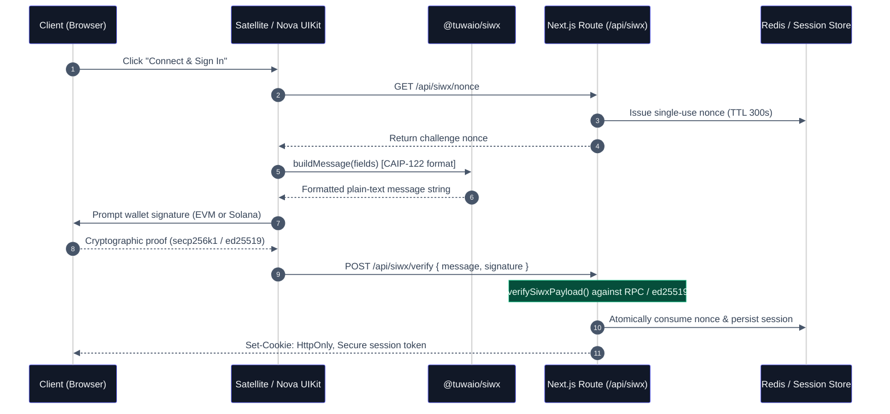

# Multi-Chain Authentication with SIWX (CAIP-122 Beyond EVM Silos)

For years, Web3 authentication began and ended with **EIP-4361 (Sign-In with Ethereum / SIWE)**. It established a cryptographic standard for logging in with an Ethereum address instead of an email or social login.

However, modern production dApps are rarely single-chain. As decentralized applications expand across EVM rollups and high-throughput non-EVM runtimes like Solana, teams inevitably hit a structural dead end:

- EVM authentication lives in an isolated SIWE workflow bound to `secp256k1`.
- Solana authentication relies on ad-hoc Base58 `ed25519` signature hacks or raw text prompts.
- The backend ends up juggling fragmented session stores, divergent token verification pipelines, and incompatible message templates.

To eliminate this fragmentation, the Web3 ecosystem established **CAIP-122 (Sign-In with X)**.

---

## 1. The Architectural Problem: Single-Chain Silos

The core limitation of EIP-4361 is its rigid binding to Ethereum-specific primitives: `secp256k1` recovery, hex encoding, and integer EVM chain IDs (`eip155:1`). When developers attempt to support Solana alongside EVM, they typically build two parallel, disconnected authentication stacks:

```
┌────────────────────────────────────────────────────────┐
│               Divergent Auth Spaghetti                 │
├───────────────────────────┬────────────────────────────┤
│ EVM Stack                 │ Solana Stack               │
├───────────────────────────┼────────────────────────────┤
│ • EIP-4361 Message Format │ • Arbitrary raw text/JSON  │
│ • viem / ethers verify    │ • tweetnacl / ed25519 hook │
│ • Hex Address Encoding    │ • Base58 Address Encoding  │
│ • Custom Session Cookie A │ • Custom Session Cookie B  │
└───────────────────────────┴────────────────────────────┘
```

### Critical Security Pitfalls of Fragmented Auth

1. **Broken Authorization Guards:** A backend route cannot reliably assert whether an active session wallet is authorized to dispatch transactions or invoke sensitive RPC actions across chains.
2. **Cross-Chain Nonce Poisoning:** Without namespace-isolated challenge tracking, nonces issued for Ethereum can be replayed or conflated with nonces signed by Solana wallets.
3. **Double Maintenance Burden:** Two sets of cookie schemas, CSRF protection layers, session lifecycles, and logout endpoints increase the attack surface exponentially.

---

## 2. Enter CAIP-122 (Sign-In with X)

CAIP-122 standardizes multi-chain wallet authentication using **Chain Agnostic Identifiers (CAIP-2 / CAIP-10)**. Instead of hardcoding Ethereum assumptions into message parsers, CAIP-122 parameterizes both the chain namespace and the account address:

```text
eip155:1:0x1234567890abcdef1234567890abcdef12345678     <-- Ethereum Mainnet (CAIP-10)
solana:5eykt4UsFv8P8NJdTREpY1vzqKqZKvdp:9WzDXwBbmkg...  <-- Solana Mainnet (CAIP-10)
```

Every CAIP-122 message includes standard CAIP-2 identifiers, server-issued cryptographic nonces, URIs, timestamps, and optional capability scopes.

### The Authentication Lifecycle

Below is the complete end-to-end authentication lifecycle—from challenge issuance to multi-chain cryptographic verification and atomic anti-replay session minting:



> [!WARNING]
> **Critical Rule: Mandatory Re-Sign on Account or Network Changes**
> CAIP-122 cryptographic proofs tightly bind the session to an exact wallet address and chain identifier (`session.address` and `session.chainId`). Whenever a user switches their active account or changes network in their wallet extension (e.g., MetaMask, Rabby, or Phantom), **a re-sign (`resign`) is strictly required**. Without performing a re-sign, the cryptographic session becomes invalid and the connection will be broken (`isSessionMatchingTarget` and `isSessionMatchingConnection` will immediately reject subsequent requests).

---

## 3. The SIWX Modular Architecture: Packages & Adapters

In the TUWA ecosystem, multi-chain authentication is partitioned into modular, highly decoupled packages across **Layer 1 (L1 - Core Engine)** and **Layer 2 (L2 - Network Adapters & Bindings)**:

```
┌────────────────────────────────────────────────────────────────────────┐
│                   TUWA SIWX Modular Architecture                       │
├────────────────────────────────────────────────────────────────────────┤
│ L1: Pure Core Engine                                                   │
│   • @tuwaio/siwx-core         CAIP-122 Builder & Parser (Zero Deps)    │
├────────────────────────────────────────────────────────────────────────┤
│ L2: Network Adapters (Multi-Chain Primitives)                          │
│   • @tuwaio/siwx-evm          EVM: Viem / Wagmi / EIP-191 / EIP-1271   │
│   • @tuwaio/siwx-solana       Solana: @solana/kit / SubtleCrypto       │
├────────────────────────────────────────────────────────────────────────┤
│ L2: Presentation & Bindings                                            │
│   • @tuwaio/siwx-react        React Hooks & Zustand Session Store      │
│   • @tuwaio/siwx-server       Backend Verifier & Next.js Handlers      │
└────────────────────────────────────────────────────────────────────────┘
```

---

## 4. Multi-Chain Network Adapter Comparison

The table below contrasts how SIWX adapters unify divergent blockchain cryptography into a single standard:

| Technical Vector            | EVM Adapter (`@tuwaio/siwx-evm`)                                            | Solana Adapter (`@tuwaio/siwx-solana`)                            |
| :-------------------------- | :-------------------------------------------------------------------------- | :---------------------------------------------------------------- |
| **CAIP-2 Namespace**        | `eip155:{chainId}` (e.g., `eip155:1`)                                       | `solana:{genesisHash}` (e.g., `solana:5eykt4Us...`)               |
| **Address Representation**  | 20-byte Hex (`0x[a-fA-F0-9]{40}`)                                           | 32-byte Base58 (`[1-9A-HJ-NP-za-km-z]{32,44}`)                    |
| **CAIP-10 Full Identifier** | `eip155:1:0xAb5801a7D398351b8bE11C439e05C5B3259aeC9B`                       | `solana:5eykt4Us...:9WzDXwBbmkg8ZTbNMqUxvQRAyrZzDsGYdLVL9zYtAWWM` |
| **Cryptographic Curve**     | `secp256k1` (Koblitz curve ECDSA)                                           | `ed25519` (Edwards-curve Digital Signature)                       |
| **Signature Format**        | 65-byte Hex string (`0x` + 130 chars: `r, s, v`)                            | 64-byte Base58 string (88 characters)                             |
| **Supported Wallets**       | MetaMask, Rabby, Rainbow, Coinbase, Safe, and all EIP-1193 standard wallets | Phantom, Solflare, Backpack, OKX, and all Wallet Standard wallets |
| **Smart Contract Accounts** | Supported natively via EIP-1271 (`isValidSignature`)                        | Program-Derived Addresses (PDAs) with authority checks            |
| **Verification Engine**     | Viem `recoverAddress` + RPC `readContract`                                  | Web Crypto API `crypto.subtle.verify` (Zero Deps)                 |

---

## 5. End-to-End Implementation in the TUWA Ecosystem

### Step 1: Client-Side Multi-Chain Signers

Developers can implement multi-chain authentication declaratively via Nova UIKit watchers, or programmatically via the `useSiwx` hook.

#### Programmatic Multi-Chain Signer Button

Below is an implementation featuring simultaneous support for EVM (`viem` / Wagmi) and Solana (`@solana/kit` / Wallet Standard):

```tsx
// src/components/MultiChainAuth.tsx
'use client';

import { useSiwx } from '@tuwaio/siwx-react';
import { createEvmSiwxSigner } from '@tuwaio/siwx-evm';
import { createSolanaSiwxSigner } from '@tuwaio/siwx-solana';
import { useAccount, useConfig } from 'wagmi';

export function MultiChainAuth({ solanaWallet }: { solanaWallet?: any }) {
  const { signIn, signOut } = useSiwx();
  const { address: evmAddress, chainId: evmChainId } = useAccount();
  const wagmiConfig = useConfig();

  // 1. Authenticate EVM Wallet (EOA or ERC-4337 Smart Account)
  const handleEvmSignIn = async () => {
    if (!evmAddress || !evmChainId) return;

    await signIn({
      signer: createEvmSiwxSigner(wagmiConfig),
      getNonce: async () => {
        const res = await fetch('/api/siwx/nonce');
        const data = await res.json();
        return data.nonce;
      },
      verifier: async (payload) => {
        const res = await fetch('/api/siwx/verify', {
          method: 'POST',
          headers: { 'Content-Type': 'application/json' },
          body: JSON.stringify(payload),
        });
        return res.ok ? res.json() : null;
      },
      fields: {
        domain: window.location.host,
        address: `eip155:${evmChainId}:${evmAddress}`,
        uri: window.location.origin,
        chainId: `eip155:${evmChainId}`,
        statement: 'Sign in to access TUWA sovereign services.',
      },
      onSuccess: (session) => {
        console.log('[SIWX] EVM Authenticated:', session.address);
      },
    });
  };

  // 2. Authenticate Solana Wallet (Wallet Standard / @solana/kit)
  const handleSolanaSignIn = async () => {
    if (!solanaWallet?.account) return;

    const solanaGenesis = '5eykt4UsFv8P8NJdTREpY1vzqKqZKvdp'; // Mainnet genesis hash
    const solanaAddress = solanaWallet.account.address;

    await signIn({
      signer: createSolanaSiwxSigner({
        wallet: solanaWallet,
        account: solanaWallet.account,
      }),
      getNonce: async () => {
        const res = await fetch('/api/siwx/nonce');
        const data = await res.json();
        return data.nonce;
      },
      verifier: async (payload) => {
        const res = await fetch('/api/siwx/verify', {
          method: 'POST',
          headers: { 'Content-Type': 'application/json' },
          body: JSON.stringify(payload),
        });
        return res.ok ? res.json() : null;
      },
      fields: {
        domain: window.location.host,
        address: `solana:${solanaGenesis}:${solanaAddress}`,
        uri: window.location.origin,
        chainId: `solana:${solanaGenesis}`,
        statement: 'Sign in to access TUWA sovereign services on Solana.',
      },
      onSuccess: (session) => {
        console.log('[SIWX] Solana Authenticated:', session.address);
      },
    });
  };

  return (
    <div className="flex gap-4">
      <button onClick={handleEvmSignIn} className="btn-primary">
        Sign In with EVM
      </button>
      <button onClick={handleSolanaSignIn} className="btn-secondary">
        Sign In with Solana
      </button>
    </div>
  );
}
```

#### Declarative Watcher Pattern with Satellite & Nova UIKit

For apps using Satellite Connect and Nova UIKit, sessions and wallet connections synchronize automatically through declarative connector watchers:

```tsx
// src/providers/SatelliteConnectProviders.tsx
'use client';

import { EVMConnectorsWatcher } from '@tuwaio/evm-sdk/nova-connect';
import { satelliteEVMAdapter } from '@tuwaio/evm-sdk/satellite';
import { NovaConnectProvider } from '@tuwaio/sdk/nova-connect';
import { SatelliteConnectProvider } from '@tuwaio/sdk/nova-connect/satellite';
import { useSiwxSessionStore } from '@tuwaio/sdk/siwx';
import { SolanaConnectorsWatcher } from '@tuwaio/solana-sdk/nova-connect';
import { satelliteSolanaAdapter } from '@tuwaio/solana-sdk/satellite';

import { appEVMChains, solanaRPCUrls, wagmiConfig } from '@/configs/appConfig';

export function SatelliteConnectProviders({ children }: { children: React.ReactNode }) {
  const siwxSession = useSiwxSessionStore((s) => s.session);

  return (
    <SatelliteConnectProvider
      adapter={[satelliteEVMAdapter(wagmiConfig, appEVMChains), satelliteSolanaAdapter({ rpcUrls: solanaRPCUrls })]}
      autoConnect={true}
    >
      {/* Session Watchers track active account and chain alignment */}
      <EVMConnectorsWatcher wagmiConfig={wagmiConfig} siwx={siwxSession ?? undefined} />
      <SolanaConnectorsWatcher siwx={siwxSession ?? undefined} />

      <NovaConnectProvider
        appChains={appEVMChains}
        solanaRPCUrls={solanaRPCUrls}
        siwx={{
          expirationSeconds: 1800,
          verifier: async (payload) => {
            const res = await fetch('/api/siwx/verify', {
              method: 'POST',
              headers: { 'Content-Type': 'application/json' },
              body: JSON.stringify(payload),
            });
            return res.ok ? res.json() : null;
          },
          destroyer: async () => {
            await fetch('/api/siwx/logout', { method: 'POST' });
          },
        }}
      >
        {children}
      </NovaConnectProvider>
    </SatelliteConnectProvider>
  );
}
```

> [!WARNING]
> **Mandatory Session Re-Signing on Account or Network Drift:**
> CAIP-122 cryptographic proofs bind a session to an exact address and chain ID (`session.address` and `session.chainId`). Whenever a user switches accounts or changes the active network in their wallet extension, the existing session becomes stale. **A re-sign (`resign`) is strictly required; otherwise, the connection will be broken**, as subsequent backend operations and client-side guards will reject the mismatched credentials. Declarative watchers like `<EVMConnectorsWatcher />` and `<SolanaConnectorsWatcher />` continuously monitor these wallet transitions, automatically invalidating stale sessions and prompting the user to re-authenticate.

---

### Step 2: Server-Side Cryptographic Verification

While the reference implementations below demonstrate **Next.js App Router** route handlers via `@tuwaio/siwx-server/next`, the core `@tuwaio/siwx-server` package is **completely framework- and backend-agnostic**. You can run `@tuwaio/siwx-server` across **Express, Fastify, NestJS, Cloudflare Workers, Hono, Elysia, Bun, or any custom Node.js HTTP server** by invoking `verifySiwxPayload()` directly with your preferred session and nonce storage adapters.

#### Production Route Handler (Atomic Redis Nonce & Session Store)

```typescript
// src/app/api/siwx/[...siwx]/route.ts
import { createSiwxApiHandler } from '@tuwaio/siwx-server/next';
import { redisClient } from '@/lib/redis';

// Atomic Redis session store implementation
const sessionStore = {
  async get(id: string) {
    const data = await redisClient.get(`siwx:sess:${id}`);
    return data ? JSON.parse(data) : null;
  },
  async create({ session, ttlSeconds }: { session: any; ttlSeconds: number }) {
    const id = crypto.randomUUID();
    await redisClient.set(`siwx:sess:${id}`, JSON.stringify({ session }), 'EX', ttlSeconds);
    return { id, session };
  },
  async revoke(id: string) {
    await redisClient.del(`siwx:sess:${id}`);
  },
};

// Atomic Redis nonce store preventing replay attacks
const nonceStore = {
  async issue({ nonce, ttlSeconds }: { nonce: string; ttlSeconds: number }) {
    await redisClient.set(`siwx:nonce:${nonce}`, '1', 'EX', ttlSeconds);
  },
  async consume({ nonce }: { nonce: string }) {
    const result = await redisClient.del(`siwx:nonce:${nonce}`);
    return result === 1; // Atomic consumption prevents double-spend/replay
  },
};

const handler = createSiwxApiHandler({
  sessionStore,
  nonceStore,
  policy: {
    expectedDomain: process.env.NEXT_PUBLIC_APP_DOMAIN!,
    requireExpirationTime: true,
    maxIssuedAtAgeSeconds: 300, // 5 minutes
    maxSessionLifetimeSeconds: 60 * 60 * 24 * 7, // 7 days
    clockSkewSeconds: 60,
  },
  cookieOptions: {
    name: 'siwx-session',
    secure: process.env.NODE_ENV === 'production',
  },
});

export const { GET, POST, DELETE } = handler;
```

#### Zero-Infrastructure Stateless Route Handler (HMAC Signed Token)

For prototypes or benchmark templates without a running Redis instance, use `createStatelessDemoSiwxHandler`:

```typescript
// src/app/api/siwx/[...siwx]/route.ts
import { createStatelessDemoSiwxHandler } from '@tuwaio/sdk/siwx/server-next';

const handler = createStatelessDemoSiwxHandler({
  signingSecret: process.env.SIWX_SIGNING_SECRET!, // Minimum 32 characters
  policy: {
    expectedDomain: ['localhost:3000', process.env.NEXT_PUBLIC_APP_DOMAIN!],
    requireExpirationTime: true,
    maxSessionLifetimeSeconds: 1800, // 30 minutes
  },
  cookieOptions: {
    name: 'siwx-demo-session',
    secure: process.env.NODE_ENV === 'production',
  },
});

export const { GET, POST, DELETE } = handler;
```

---

### Step 3: Guarding Server Actions & Backend Dispatches

Before executing sensitive state changes, invoking RPC actions, or syncing data with the Quasar Cloud Indexer, verify the active session:

```typescript
// src/app/actions/transaction.ts
'use server';

import { getSiwxServerSession, isSessionMatchingTarget } from '@tuwaio/siwx-server';
import { cookies } from 'next/headers';
import { sessionStore } from '@/lib/authStores';

export async function submitProtectedOperation({
  targetAddress,
  chainId,
  actionPayload,
}: {
  targetAddress: string;
  chainId: string;
  actionPayload: Record<string, unknown>;
}) {
  const cookieStore = await cookies();

  // 1. Resolve active session from durable store or signed cookie
  const session = await getSiwxServerSession({
    cookieSource: cookieStore,
    cookieName: 'siwx-session',
    sessionStore, // Or `signingSecret` when using stateless profile
    policy: {
      expectedDomain: process.env.NEXT_PUBLIC_APP_DOMAIN!,
    },
  });

  if (!session) {
    throw new Error('Unauthorized: No active or valid SIWX session found.');
  }

  // 2. Cryptographic claim verification: assert wallet ownership matches target
  const isMatch = isSessionMatchingTarget(session, targetAddress, chainId);
  if (!isMatch) {
    throw new Error(
      `Forbidden: Session wallet (${session.address}) does not match transaction sender (${targetAddress}).`,
    );
  }

  // 3. Proceed with authorized operation
  console.log(`[Authorized] Dispatched for ${session.address} on ${session.chainId}`);
  return { success: true, processedAt: new Date().toISOString() };
}
```

> [!IMPORTANT]
> `isSessionMatchingTarget` provides cross-chain address equivalence. It normalizes raw EVM hex strings (`0x1234...`), checksummed representations, Solana Base58 strings, and fully qualified CAIP-10 strings (`eip155:1:0x1234...` or `solana:5eykt4Us...`). If an account or network switch occurred in the user's wallet without a subsequent re-sign (`resign`), this validation will reject the request, ensuring unauthenticated or drifted connections never execute protected state transitions.

---

## 6. Technical Comparison: EIP-4361 vs. CAIP-122 (SIWX)

| Architectural Dimension     | EIP-4361 (SIWE)                          | CAIP-122 (@tuwaio/siwx)                                             |
| :-------------------------- | :--------------------------------------- | :------------------------------------------------------------------ |
| **Network Scope**           | Ethereum & EVM Rollups only              | Multi-Chain (EVM & Solana production-ready; extensible via CAIP-2)  |
| **Chain Identification**    | Integer Chain ID (`1`, `137`, `8453`)    | CAIP-2 Standard (`eip155:1`, `solana:5eykt4...`)                    |
| **Address Encoding**        | Strict Hex format (`0x[a-fA-F0-9]{40}`)  | Multi-format: Hex (EVM) and Base58 (Solana) via CAIP-10             |
| **Signature Schemes**       | `secp256k1` (`personal_sign` / EIP-1271) | `secp256k1` (EIP-191 / EIP-1271) and `ed25519` (Edwards curve)      |
| **Session Model**           | EVM-bound isolated cookies               | Unified, chain-agnostic session schema (`SiwxSession`)              |
| **Verification Primitives** | Viem / ethers `verifyMessage`            | Deterministic multi-runtime routing (`verifySiwxPayload`)           |
| **Anti-Replay Mechanism**   | Ad-hoc server string check               | Built-in atomic single-use nonce lifecycle store (`SiwxNonceStore`) |

---

## Conclusion

Building bespoke authentication silos for EVM and non-EVM runtimes creates architectural fragility, fragments session state, and introduces serious authorization vulnerabilities.

By adopting **CAIP-122 via `@tuwaio/siwx`**, dApps establish a sovereign, zero-custody identity boundary. Wallets verify their identity across diverse cryptographic curves with zero vendor lock-in and a singular, auditable backend policy.

---

## Next Steps

- **API Documentation:** Explore hook signatures and types on the [@tuwaio/siwx Documentation Space](https://siwx.docs.tuwa.io/).
- **Transaction Lifecycle:** Read [Why Web3 Transaction State is Broken](/guides/why-web3-transaction-state-is-broken) to see how SIWX sessions secure the Pulsar transaction state machine.
- **Connection Layer:** Learn how wallet state is managed independently of the UI in [Satellite Connect](https://satellite.docs.tuwa.io/).
- **Reference Examples:** Inspect the production templates in the [Cosmos Playground](https://github.com/TuwaIO/cosmos-playground).
