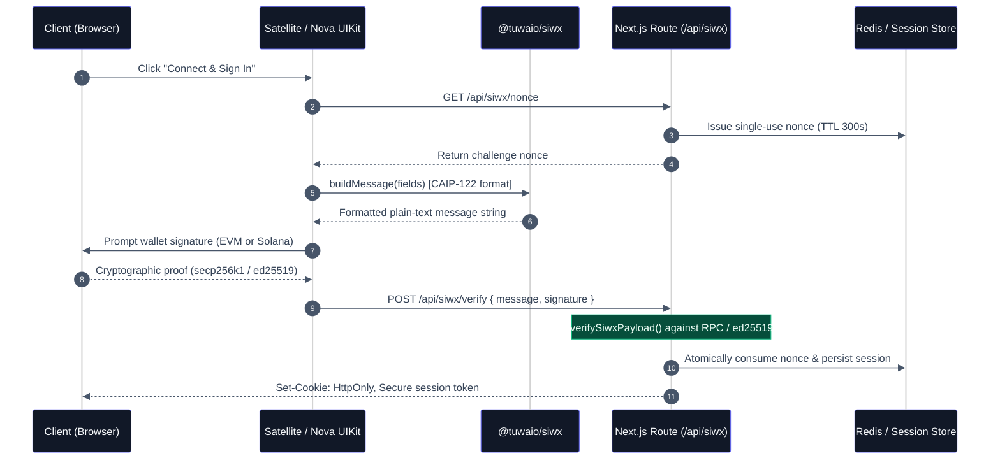

# Multi-Chain Authentication with SIWX (CAIP-122 Beyond EVM Silos)

For years, Web3 authentication began and ended with **EIP-4361 (Sign-In with Ethereum / SIWE)**. It established a cryptographic standard for logging in with an Ethereum address instead of an email or social login.

However, modern production dApps are rarely single-chain. As decentralized applications expand across EVM rollups and high-throughput non-EVM runtimes like Solana, teams inevitably hit a structural dead end:

- EVM authentication lives in an isolated SIWE workflow bound to `secp256k1`.
- Solana authentication relies on ad-hoc Base58 `ed25519` signature hacks or raw text prompts.
- The backend ends up juggling fragmented session stores, divergent token verification pipelines, and incompatible message templates.

To eliminate this fragmentation, the Web3 ecosystem established **CAIP-122 (Sign-In with X)**.

---

## 1. The Architectural Problem: Single-Chain Silos

The core limitation of EIP-4361 is its rigid binding to Ethereum-specific primitives: `secp256k1` recovery, hex encoding, and integer EVM chain IDs (`eip155:1`). When developers attempt to support Solana alongside EVM, they typically build two parallel, disconnected authentication stacks:

```
┌────────────────────────────────────────────────────────┐
│               Divergent Auth Spaghetti                 │
├───────────────────────────┬────────────────────────────┤
│ EVM Stack                 │ Solana Stack               │
├───────────────────────────┼────────────────────────────┤
│ • EIP-4361 Message Format │ • Arbitrary raw text/JSON  │
│ • viem / ethers verify    │ • tweetnacl / ed25519 hook │
│ • Hex Address Encoding    │ • Base58 Address Encoding  │
│ • Custom Session Cookie A │ • Custom Session Cookie B  │
└───────────────────────────┴────────────────────────────┘
```

### Critical Security Pitfalls of Fragmented Auth

1. **Broken Authorization Guards:** A backend route cannot reliably assert whether an active session wallet is authorized to dispatch transactions or invoke sensitive RPC actions across chains.
2. **Cross-Chain Nonce Poisoning:** Without namespace-isolated challenge tracking, nonces issued for Ethereum can be replayed or conflated with nonces signed by Solana wallets.
3. **Double Maintenance Burden:** Two sets of cookie schemas, CSRF protection layers, session lifecycles, and logout endpoints increase the attack surface exponentially.

---

## 2. Enter CAIP-122 (Sign-In with X)

CAIP-122 standardizes multi-chain wallet authentication using **Chain Agnostic Identifiers (CAIP-2 / CAIP-10)**. Instead of hardcoding Ethereum assumptions into message parsers, CAIP-122 parameterizes both the chain namespace and the account address:

```text
eip155:1:0x1234567890abcdef1234567890abcdef12345678     <-- Ethereum Mainnet (CAIP-10)
solana:5eykt4UsFv8P8NJdTREpY1vzqKqZKvdp:9WzDXwBbmkg...  <-- Solana Mainnet (CAIP-10)
```

Every CAIP-122 message includes standard CAIP-2 identifiers, server-issued cryptographic nonces, URIs, timestamps, and optional capability scopes.

### The Authentication Lifecycle

Below is the complete end-to-end authentication lifecycle—from challenge issuance to multi-chain cryptographic verification and atomic anti-replay session minting:


```mermaid
%%{init: {
  'theme': 'base',
  'themeVariables': {
    'actorBkg': '#111827',
    'actorBorder': '#6366f1',
    'actorTextColor': '#f8fafc',
    'actorLineColor': '#D3D3D3',
    'noteBkgColor': '#064e3b',
    'noteBorderColor': '#10b981',
    'noteTextColor': '#ecfdf5',
    'signalColor': '#475569',
    'signalTextColor': '#334155'
  }
}}%%
sequenceDiagram
  autonumber
  participant User as Client (Browser)
  participant UI as Satellite / Nova UIKit
  participant SIWX as @tuwaio/siwx
  participant API as Next.js Route (/api/siwx)
  participant Store as Redis / Session Store

  User->>UI: Click "Connect & Sign In"
  UI->>API: GET /api/siwx/nonce
  API->>Store: Issue single-use nonce (TTL 300s)
  API-->>UI: Return challenge nonce
  UI->>SIWX: buildMessage(fields) [CAIP-122 format]
  SIWX-->>UI: Formatted plain-text message string
  UI->>User: Prompt wallet signature (EVM or Solana)
  User-->>UI: Cryptographic proof (secp256k1 / ed25519)
  UI->>API: POST /api/siwx/verify { message, signature }
  Note over API: verifySiwxPayload() against RPC / ed25519
  API->>Store: Atomically consume nonce & persist session
  API-->>User: Set-Cookie: HttpOnly, Secure session token
```

> [!WARNING]
>
> **Critical Rule: Mandatory Re-Sign on Account or Network Changes**
> CAIP-122 cryptographic proofs tightly bind the session to an exact wallet address and chain identifier (`session.address` and `session.chainId`). Whenever a user switches their active account or changes network in their wallet extension (e.g., MetaMask, Rabby, or Phantom), **the new account or chain must sign in again**. Until it does, the session no longer matches the wallet: `isSessionMatchingConnection` returns `false` in the browser and `isSessionMatchingTarget` rejects the request on your server.

---

## 3. The SIWX Modular Architecture: Packages & Adapters

In the TUWA ecosystem, multi-chain authentication is partitioned into modular, highly decoupled packages across **Layer 1 (L1 - Core Engine)** and **Layer 2 (L2 - Network Adapters & Bindings)**:

```
┌────────────────────────────────────────────────────────────────────────┐
│                   TUWA SIWX Modular Architecture                       │
├────────────────────────────────────────────────────────────────────────┤
│ L1: Pure Core Engine                                                   │
│   • @tuwaio/siwx-core         CAIP-122 Builder & Parser (Zero Deps)    │
├────────────────────────────────────────────────────────────────────────┤
│ L2: Network Adapters (Multi-Chain Primitives)                          │
│   • @tuwaio/siwx-evm          EVM: Viem / Wagmi / EIP-191 / EIP-1271   │
│   • @tuwaio/siwx-solana       Solana: @solana/kit / SubtleCrypto       │
├────────────────────────────────────────────────────────────────────────┤
│ L2: Presentation & Bindings                                            │
│   • @tuwaio/siwx-react        React Hooks & Zustand Session Store      │
│   • @tuwaio/siwx-server       Backend Verifier & Next.js Handlers      │
└────────────────────────────────────────────────────────────────────────┘
```

---

## 4. Multi-Chain Network Adapter Comparison

The table below contrasts how SIWX adapters unify divergent blockchain cryptography into a single standard:

| Technical Vector            | EVM Adapter (`@tuwaio/siwx-evm`)                                            | Solana Adapter (`@tuwaio/siwx-solana`)                            |
| :-------------------------- | :-------------------------------------------------------------------------- | :---------------------------------------------------------------- |
| **CAIP-2 Namespace**        | `eip155:{chainId}` (e.g., `eip155:1`)                                       | `solana:{genesisHash}` (e.g., `solana:5eykt4Us...`)               |
| **Address Representation**  | 20-byte Hex (`0x[a-fA-F0-9]{40}`)                                           | 32-byte Base58 (`[1-9A-HJ-NP-za-km-z]{32,44}`)                    |
| **CAIP-10 Full Identifier** | `eip155:1:0xAb5801a7D398351b8bE11C439e05C5B3259aeC9B`                       | `solana:5eykt4Us...:9WzDXwBbmkg8ZTbNMqUxvQRAyrZzDsGYdLVL9zYtAWWM` |
| **Cryptographic Curve**     | `secp256k1` (Koblitz curve ECDSA)                                           | `ed25519` (Edwards-curve Digital Signature)                       |
| **Signature Format**        | 65-byte Hex string (`0x` + 130 chars: `r, s, v`)                            | 64-byte Base58 string (88 characters)                             |
| **Supported Wallets**       | MetaMask, Rabby, Rainbow, Coinbase, Safe, and all EIP-1193 standard wallets | Phantom, Solflare, Backpack, OKX, and all Wallet Standard wallets |
| **Smart Contract Accounts** | Supported via EIP-1271 (`isValidSignature`) (deployed contracts)            | Not supported (Keypairs only; PDAs are off-curve & keyless)       |
| **Verification Engine**     | Viem `recoverAddress` (EIP-191) + RPC `readContract` (EIP-1271)             | Native Web Crypto API `crypto.subtle.verify` (Ed25519, Zero Deps) |

> [!NOTE]
>
> Satellite Connect names Solana clusters (`mainnet`, `devnet`, `testnet`); `getSatelliteSiwxFields` turns the cluster into its CAIP-2 chain ID with the genesis hash, as CAIP-30 requires: `solana:5eykt4UsFv8P8NJdTREpY1vzqKqZKvdp` for mainnet, `solana:EtWTRABZaYq6iMfeYKouRu166VU2xqa1` for devnet. List these IDs in `allowedChainIds` when your verification policy restricts chains (`SOLANA_CHAIN_IDS` of `@tuwaio/orbit-core` holds them). Sessions signed for `solana:mainnet` or `solana:devnet` by earlier versions still match them: SIWX treats a cluster name and its genesis-hash ID as the same chain.

---

## 5. End-to-End Implementation in the TUWA Ecosystem

### Step 1: Client-Side Multi-Chain Sign-In

With Nova UI Kit, sign-in is declarative: pass `siwx` to `NovaConnectProvider` and it asks every connected account to sign in (see the watcher pattern below). Without Nova, call `useSiwx().signIn` for the active Satellite Connect connection.

#### Programmatic Sign-In Button with Satellite Connect

The button below signs in the active wallet, EVM or Solana. `getSatelliteSiwxFields` turns the connection into the CAIP-2 chain ID and the CAIP-10 address. EVM wallets sign through the wagmi config with `createEvmSiwxSigner`, so the app needs neither `wagmi` React hooks nor `WagmiProvider`; Solana wallets sign with the `signMessage` of their Wallet Standard connection.

```tsx
// src/components/SignInButton.tsx
'use client';

import { createEvmSiwxSigner } from '@tuwaio/evm-sdk/siwx';
import { useSatelliteConnectStore } from '@tuwaio/sdk/satellite';
import {
  createSatelliteSiwxSigner,
  getSatelliteSiwxFields,
  isSessionMatchingConnection,
  useSiwx,
  useSiwxSession,
} from '@tuwaio/sdk/siwx';
import type { SolanaConnection } from '@tuwaio/solana-sdk/satellite';

import { wagmiConfig } from '@/configs/appConfig';

export function SignInButton() {
  const activeConnection = useSatelliteConnectStore((state) => state.activeConnection);
  const { signIn, signOut } = useSiwx();
  const { session, status } = useSiwxSession();

  if (!activeConnection?.isConnected) return null;
  // The SIWX helpers read the account and the chain of the connection
  const account = { address: activeConnection.address, chainId: activeConnection.chainId };

  // The session was issued for this account and chain: an account or network switch shows "Sign in" again
  if (isSessionMatchingConnection(session, account)) {
    return (
      <button
        onClick={async () => {
          await fetch('/api/siwx/logout', { method: 'POST' });
          signOut();
        }}
      >
        Sign out
      </button>
    );
  }

  const handleSignIn = async () =>
    signIn({
      // EVM wallets sign through wagmi; a Solana connection carries the signMessage of its Wallet Standard wallet
      signer: activeConnection.connectorType.startsWith('evm:')
        ? createEvmSiwxSigner(wagmiConfig)
        : await createSatelliteSiwxSigner(activeConnection as SolanaConnection),
      getNonce: async () => {
        const res = await fetch('/api/siwx/nonce');
        return ((await res.json()) as { nonce: string }).nonce;
      },
      verifier: async (payload) => {
        const res = await fetch('/api/siwx/verify', {
          method: 'POST',
          headers: { 'Content-Type': 'application/json' },
          body: JSON.stringify(payload),
        });
        return res.ok ? res.json() : null;
      },
      // eip155:11155111:0x… for an EVM wallet, solana:EtWTRABZaYq6iMfeYKouRu166VU2xqa1:… for a Solana devnet one
      fields: getSatelliteSiwxFields(account, { statement: 'Sign in to access TUWA sovereign services.' }),
      onSuccess: (session) => console.log('[SIWX] Signed in:', session.address),
    });

  return (
    <button onClick={handleSignIn} disabled={status !== 'idle' && status !== 'error'}>
      Sign in
    </button>
  );
}
```

#### Declarative Watcher Pattern with Satellite & Nova UIKit

For apps using Satellite Connect and Nova UIKit, sessions and wallet connections synchronize automatically through declarative connector watchers.

> [!NOTE]
>
> In full-stack TUWA applications, developers can import either from granular packages (`@tuwaio/nova-connect`, `@tuwaio/siwx-react`, `@tuwaio/satellite-*`) or from unified metapackage subpaths (`@tuwaio/sdk`, `@tuwaio/evm-sdk`, `@tuwaio/solana-sdk`). Both provide identical API surfaces.

```tsx
// src/providers/SatelliteConnectProviders.tsx
'use client';

import { EVMConnectorsWatcher } from '@tuwaio/evm-sdk/nova-connect';
import { satelliteEVMAdapter } from '@tuwaio/evm-sdk/satellite';
import { NovaConnectProvider } from '@tuwaio/sdk/nova-connect';
import { SatelliteConnectProvider } from '@tuwaio/sdk/nova-connect/satellite';
import { SolanaConnectorsWatcher } from '@tuwaio/solana-sdk/nova-connect';
import { satelliteSolanaAdapter } from '@tuwaio/solana-sdk/satellite';

import { appEVMChains, solanaRPCUrls, wagmiConfig } from '@/configs/appConfig';

export function SatelliteConnectProviders({ children }: { children: React.ReactNode }) {
  return (
    <SatelliteConnectProvider
      adapter={[satelliteEVMAdapter(wagmiConfig, appEVMChains), satelliteSolanaAdapter({ rpcUrls: solanaRPCUrls })]}
      autoConnect={true}
    >
      {/* The watchers follow account and network changes made in the wallet */}
      <EVMConnectorsWatcher wagmiConfig={wagmiConfig} />
      <SolanaConnectorsWatcher />

      <NovaConnectProvider
        appChains={appEVMChains}
        solanaRPCUrls={solanaRPCUrls}
        siwx={{
          expirationSeconds: 1800,
          getNonce: async () => {
            const res = await fetch('/api/siwx/nonce');
            return ((await res.json()) as { nonce: string }).nonce;
          },
          verifier: async (payload) => {
            const res = await fetch('/api/siwx/verify', {
              method: 'POST',
              headers: { 'Content-Type': 'application/json' },
              body: JSON.stringify(payload),
            });
            return res.ok ? res.json() : null;
          },
          destroyer: async () => {
            await fetch('/api/siwx/logout', { method: 'POST' });
          },
        }}
      >
        {children}
      </NovaConnectProvider>
    </SatelliteConnectProvider>
  );
}
```

> [!WARNING]
>
> **One Session per Account and Chain:**
> A CAIP-122 session is bound to one address and one chain ID (`session.address` and `session.chainId`). With `siwx` on `NovaConnectProvider`, Nova's `NovaSiwxWatcher` asks every newly connected account to sign in, disconnects the wallet when the user rejects it, and signs out when the wallet disconnects. Pass `siwx` to `NovaConnectProvider` only: the `siwx` prop of `EVMConnectorsWatcher` and `SolanaConnectorsWatcher` is for apps without Nova, and makes the watchers disconnect the wallet on an account change instead of asking the new account to sign in.

---

### Step 2: Server-Side Cryptographic Verification

While the reference implementations below demonstrate **Next.js App Router** route handlers via `@tuwaio/siwx-server/next` (`@tuwaio/sdk/siwx/server-next` in the SDK), the core `@tuwaio/siwx-server` package is **completely framework- and backend-agnostic**. You can run `@tuwaio/siwx-server` across **Express, Fastify, NestJS, Cloudflare Workers, Hono, Elysia, Bun, or any custom Node.js HTTP server** by invoking `verifySiwxPayload()` directly with your preferred session and nonce storage adapters.

#### Production Route Handler (Atomic Redis Nonce & Session Store)

```typescript
// src/app/api/siwx/[...siwx]/route.ts
import type { SiwxNonceStore, SiwxSession, SiwxSessionRecord, SiwxSessionStore } from '@tuwaio/sdk/siwx/server';
import { createSiwxApiHandler } from '@tuwaio/sdk/siwx/server-next';

import { redisClient } from '@/lib/redis';

// Atomic Redis session store conforming to SiwxSessionStore
const sessionStore: SiwxSessionStore = {
  async get(id: string): Promise<SiwxSessionRecord | null> {
    const data = await redisClient.get(`siwx:sess:${id}`);
    return data ? (JSON.parse(data) as SiwxSessionRecord) : null;
  },
  async create({ session, ttlSeconds }: { session: SiwxSession; ttlSeconds: number }): Promise<SiwxSessionRecord> {
    const id = crypto.randomUUID();
    const createdAt = Date.now();
    const expiresAt = createdAt + ttlSeconds * 1000;
    const record: SiwxSessionRecord = { id, session, createdAt, expiresAt };
    await redisClient.set(`siwx:sess:${id}`, JSON.stringify(record), 'EX', ttlSeconds);
    return record;
  },
  // Links the wallet session to your own user record after sign-in; SIWX itself never calls it
  async bindSubject(id: string, subjectId: string): Promise<boolean> {
    const data = await redisClient.get(`siwx:sess:${id}`);
    if (!data) return false;
    const record = { ...(JSON.parse(data) as SiwxSessionRecord), subjectId };
    await redisClient.set(`siwx:sess:${id}`, JSON.stringify(record), 'KEEPTTL');
    return true;
  },
  async revoke(id: string): Promise<void> {
    await redisClient.del(`siwx:sess:${id}`);
  },
};

// Atomic Redis nonce store preventing replay attacks
const nonceStore: SiwxNonceStore = {
  async issue({ nonce, ttlSeconds }: { nonce: string; ttlSeconds: number }) {
    await redisClient.set(`siwx:nonce:${nonce}`, '1', 'EX', ttlSeconds);
  },
  async consume({ nonce }: { nonce: string }) {
    const result = await redisClient.del(`siwx:nonce:${nonce}`);
    return result === 1; // Atomic consumption prevents double-spend/replay
  },
};

const handler = createSiwxApiHandler({
  sessionStore,
  nonceStore,
  policy: {
    expectedDomain: process.env.NEXT_PUBLIC_APP_DOMAIN!,
    requireExpirationTime: true,
    maxIssuedAtAgeSeconds: 300, // 5 minutes
    maxSessionLifetimeSeconds: 60 * 60 * 24 * 7, // 7 days
    clockSkewSeconds: 60,
  },
  cookieOptions: {
    name: 'siwx-session',
    secure: process.env.NODE_ENV === 'production',
  },
});

export const { GET, POST, DELETE } = handler;
```

#### Zero-Infrastructure Stateless Route Handler (HMAC Signed Token)

For prototypes or benchmark templates without a running Redis instance, use `createStatelessDemoSiwxHandler`:

```typescript
// src/app/api/siwx/[...siwx]/route.ts
import { createStatelessDemoSiwxHandler } from '@tuwaio/sdk/siwx/server-next';

const handler = createStatelessDemoSiwxHandler({
  signingSecret: process.env.SIWX_SIGNING_SECRET!, // Minimum 32 characters
  policy: {
    expectedDomain: ['localhost:3000', process.env.NEXT_PUBLIC_APP_DOMAIN!],
    requireExpirationTime: true,
    maxSessionLifetimeSeconds: 1800, // 30 minutes
  },
  cookieOptions: {
    name: 'siwx-demo-session',
    secure: process.env.NODE_ENV === 'production',
  },
});

export const { GET, POST, DELETE } = handler;
```

---

### Step 3: Guarding Server Actions & Backend Dispatches

Before executing sensitive state changes, invoking RPC actions, or syncing data with a Quasar engine (Cloud or self-hosted), verify the active session:

```typescript
// src/app/actions/transaction.ts
'use server';

import { getSiwxServerSession, isSessionMatchingTarget } from '@tuwaio/sdk/siwx/server';
import { cookies } from 'next/headers';

import { sessionStore } from '@/lib/authStores';

export async function submitProtectedOperation({
  targetAddress,
  chainId,
  actionPayload,
}: {
  targetAddress: string;
  chainId: string;
  actionPayload: Record<string, unknown>;
}) {
  const cookieStore = await cookies();

  // 1. Resolve active session from durable store or signed cookie
  const session = await getSiwxServerSession({
    cookieSource: cookieStore,
    cookieName: 'siwx-session',
    sessionStore, // Or `signingSecret` when using stateless profile
    policy: {
      expectedDomain: process.env.NEXT_PUBLIC_APP_DOMAIN!,
    },
  });

  if (!session) {
    throw new Error('Unauthorized: No active or valid SIWX session found.');
  }

  // 2. Cryptographic claim verification: assert wallet ownership matches target
  const isMatch = isSessionMatchingTarget(session, targetAddress, chainId);
  if (!isMatch) {
    throw new Error(
      `Forbidden: Session wallet (${session.address}) does not match transaction sender (${targetAddress}).`,
    );
  }

  // 3. Proceed with authorized operation
  console.log(`[Authorized] Dispatched for ${session.address} on ${session.chainId}`);
  return { success: true, processedAt: new Date().toISOString() };
}
```

> [!IMPORTANT]
>
> `isSessionMatchingTarget` provides cross-chain address equivalence. It normalizes raw EVM hex strings (`0x1234...`), checksummed representations, Solana Base58 strings, and fully qualified CAIP-10 strings (`eip155:1:0x1234...` or `solana:5eykt4Us...`). If an account or network switch occurred in the user's wallet without a subsequent re-sign (`resign`), this validation will reject the request, ensuring unauthenticated or drifted connections never execute protected state transitions. A Solana chain matches under its cluster name and its genesis-hash chain ID, so `tx.chainId` of Pulsar 0.9 (`solana:EtWTRABZ…`) matches a session signed for `solana:devnet`.

---

## 6. Technical Comparison: EIP-4361 vs. CAIP-122 (SIWX)

| Architectural Dimension     | EIP-4361 (SIWE)                          | CAIP-122 (@tuwaio/siwx)                                             |
| :-------------------------- | :--------------------------------------- | :------------------------------------------------------------------ |
| **Network Scope**           | Ethereum & EVM Rollups only              | Multi-Chain (EVM & Solana production-ready; extensible via CAIP-2)  |
| **Chain Identification**    | Integer Chain ID (`1`, `137`, `8453`)    | CAIP-2 Standard (`eip155:1`, `solana:5eykt4...`)                    |
| **Address Encoding**        | Strict Hex format (`0x[a-fA-F0-9]{40}`)  | Multi-format: Hex (EVM) and Base58 (Solana) via CAIP-10             |
| **Signature Schemes**       | `secp256k1` (`personal_sign` / EIP-1271) | `secp256k1` (EIP-191 / EIP-1271) and `ed25519` (Edwards curve)      |
| **Session Model**           | EVM-bound isolated cookies               | Unified, chain-agnostic session schema (`SiwxSession`)              |
| **Verification Primitives** | Viem / ethers `verifyMessage`            | Deterministic multi-runtime routing (`verifySiwxPayload`)           |
| **Anti-Replay Mechanism**   | Ad-hoc server string check               | Built-in atomic single-use nonce lifecycle store (`SiwxNonceStore`) |

---

## Conclusion

Building bespoke authentication silos for EVM and non-EVM runtimes creates architectural fragility, fragments session state, and introduces serious authorization vulnerabilities.

By adopting **CAIP-122 via `@tuwaio/siwx`**, dApps establish a non-custodial identity boundary: wallets prove ownership across different signature curves, and every signature is verified on your own backend under a single, auditable policy — built on an open standard and open-source (Apache-2.0) packages instead of a hosted identity provider.

---

## Next Steps

- **API Documentation:** Explore hook signatures and types on the [@tuwaio/siwx Documentation Space](https://siwx.docs.tuwa.io/).
- **Transaction Lifecycle:** Read [Why Web3 Transaction State is Broken](/guides/why-web3-transaction-state-is-broken) to see how SIWX sessions secure the Pulsar transaction state machine.
- **Connection Layer:** Learn how wallet state is managed independently of the UI in [Satellite Connect](https://satellite.docs.tuwa.io/).
- **Reference Examples:** Inspect the production templates in the [Cosmos Playground](https://github.com/TuwaIO/cosmos-playground).
