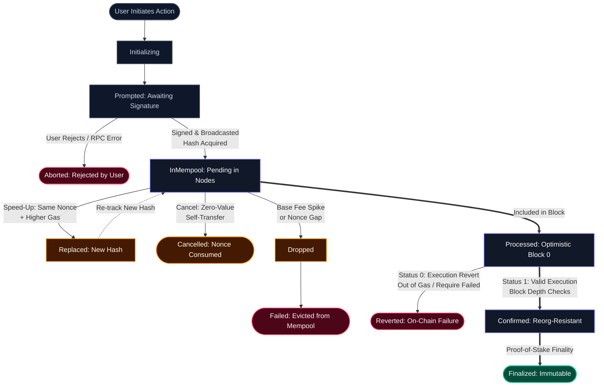

# Why Web3 Transaction State Management is Broken (And Why `useState` is an Anti-Pattern)

Most Web3 frontends treat blockchain interactions as standard HTTP `POST` requests. They fire an RPC call, slap a loading spinner onto a local React component state, and pray the user doesn't touch anything until a transaction hash returns.

```tsx
// ⚠️ THE FATAL ANTI-PATTERN: Component-bound transaction state
export function SwapButton() {
  const [isLoading, setIsLoading] = useState(false);
  const [txHash, setTxHash] = useState<string | null>(null);

  const handleDeposit = async () => {
    try {
      setIsLoading(true);
      // Step 1: Wallet signature & broadcast
      const hash = await walletClient.sendTransaction({ ... });
      setTxHash(hash);

      // Step 2: Awaiting on-chain receipt in component memory
      await publicClient.waitForTransactionReceipt({ hash });
      toast.success('Transaction confirmed!');
    } catch (error) {
      console.error('Transaction failed:', error);
      toast.error('Transaction reverted');
    } finally {
      setIsLoading(false);
    }
  };

  return (
    <button onClick={handleDeposit} disabled={isLoading}>
      {isLoading ? 'Processing...' : 'Deposit Funds'}
    </button>
  );
}
```

This pattern is fundamentally flawed. It collapses the moment it encounters real-world distributed blockchain mechanics: mempool congestion, fee spikes, dropped nonces, wallet speed-ups, tab switching, and route transitions.

---

## 1. The Distributed State Mismatch

In classical Web2 client-server architectures, a request follows a synchronous, binary lifecycle:

```
Pending  ──►  Resolved (200 OK)   or   Rejected (500 Error)
```

A blockchain transaction is **not an HTTP request**. It is an asynchronous, multi-phase state transition submitted to a decentralized, adversarial peer-to-peer network:



When your frontend models this complex lifecycle as a boolean `isLoading`, your application breaks across multiple critical failure modes.

---

## 2. Four Production Failure Modes of `useState`

### Failure Mode 1: The Component Unmount Bug

When a user initiates a transaction (e.g., swapping tokens or staking collateral) and then navigates to `/portfolio` or closes a modal sheet, **React unmounts the originating component**.

1. The local `useState` variables (`isLoading`, `txHash`) are destroyed.
2. The asynchronous promise chain (`waitForTransactionReceipt`) is garbage-collected or becomes an unhandled promise rejection.
3. The UI loses all awareness of the pending transaction.
4. When the user navigates back, the button is reset to idle. The user believes their transaction vanished or failed, prompting them to submit a duplicate transaction that results in wasted gas or inadvertent double-spending.

### Failure Mode 2: The Mempool Replacement Trap (Speed-Ups and Cancels)

When Ethereum or an EVM rollup experiences gas volatility, a transaction can sit pending in the mempool for minutes. Users routinely open MetaMask, Rabby, or Coinbase Wallet and click **"Speed Up"** or **"Cancel"**.

Here is what happens at the network layer:

- The wallet generates a **new transaction** `T2` with the **same account nonce** `N` as the original transaction `T1`.
- `T2` includes a `>= 10%` bump in `maxPriorityFeePerGas` / `maxFeePerGas`.
- The network assigns `T2` a **completely different transaction hash**:

```
Hash(T2) ≠ Hash(T1)    (Account Nonce N is identical)
```

Your naive component is still awaiting receipt for the orphaned hash $H_1$:

```ts
await publicClient.waitForTransactionReceipt({ hash: H1 }); // ❌ WILL NEVER RESOLVE
```

Validators mine $T_2$. The nonce $N$ is consumed. The original transaction $H_1$ is permanently evicted from the mempool. **Your dApp stays locked in an infinite loading spinner** until the user hard-refreshes the browser.

### Failure Mode 3: Cross-Tab & Browser Reload Amnesia

Transactions take anywhere from 12 seconds (Ethereum) to several minutes under network congestion. Users frequently:

- Open a second tab to continue browsing your dApp.
- Accidentally reload the page.
- Switch mobile apps while waiting for wallet signing.

Component state lives exclusively in ephemeral RAM. A single refresh obliterates all in-flight tracking state. The transaction is still active in the mempool, but your frontend has forgotten it entirely.

### Failure Mode 4: Soft Confirmations vs. Finality

On high-throughput chains like Solana or optimistic rollups (Arbitrum, Base), a transaction passes through distinct consensus stages:

| Stage              | Solana Status | EVM Rollup Status    | Safe to Assume Complete?       |
| :----------------- | :------------ | :------------------- | :----------------------------- |
| **Optimistic**     | `processed`   | L2 Sequencer Receipt | ⚠️ Re-org possible             |
| **Consensus Safe** | `confirmed`   | L1 Batch Submission  | ✅ High certainty              |
| **Immutable**      | `finalized`   | L1 Finalized State   | 🔒 Mathematically irreversible |

A boolean `isLoading` cannot represent these transitions, resulting in premature cache invalidation and race conditions where frontend queries fetch stale blockchain state.

---

## 3. The Solution: Decoupled, Local-First State Machines

To build resilient Web3 frontends, transaction tracking must **never live in React components**. It must exist in an independent, headless state machine that operates outside the DOM tree:

```
┌─────────────────────────────────────────────────────────────┐
│                  Blockchain Transports Layer                │
│    Viem (EVM) • @solana/kit (Solana) • Bundlers (ERC-4337)  │
└──────────────────────────────┬──────────────────────────────┘
                               │ (Dispatched Actions)
                               ▼
┌──────────────────────────────┴──────────────────────────────┐
│              Headless Engine (@tuwaio/pulsar-core)          │
│  • Local-first Indexed/LocalStorage Persistence (Immer)     │
│  • Nonce-aware Mempool Replacement Watcher (onReplaced)     │
│  • Auto-reconnection & Polling Resumption after Reload      │
└──────────────────────────────┬──────────────────────────────┘
                               │ (Passive Subscriptions)
                               ▼
┌──────────────────────────────┴──────────────────────────────┐
│                 React View Layer (Passive)                  │
│       Subscribes to selectors: usePulsarStore(...)          │
└─────────────────────────────────────────────────────────────┘
```

A production-grade Web3 transaction architecture enforces four non-negotiable rules:

1. **Persistent Store as Single Source of Truth:** Broadcasted transactions must be synchronously serialized and saved to persistent storage (`localStorage` / `IndexedDB`) before awaiting network confirmation.
2. **Nonce-Aware Replacement Detection:** The tracker detects when a transaction with hash `H1` is replaced in the mempool (e.g., speed-up or cancel via identical nonce). The store transitions `H1` to `TransactionStatus.Replaced`, records `replacedTxHash` (`H2`), and fires the `onReplaced(newTx, oldTx)` callback. Pulsar marks the superseded record and hands off the newly emitted transaction to the consuming application layer.
3. **Resilient Session Resumption:** When a user refreshes or reopens the application, a bootstrap routine scans the pool and concurrently resumes polling for all transactions still marked as `pending: true`.
4. **Passive UI Binding:** Components do not manage transaction promises. They merely read state slices via selectors (`selectPendingTransactions`, `selectTxByKey`).

---

## 4. Implementation in the TUWA Ecosystem

The TUWA stack implements this architecture via **Pulsar Engine** (`@tuwaio/pulsar-core`, `@tuwaio/pulsar-evm`, `@tuwaio/pulsar-solana`).

### Step 1: Define Strongly-Typed Transaction Unions

Transactions carry custom business payloads (e.g., token amounts, recipient addresses) alongside protocol metadata:

```typescript
// src/types/transactions.ts
import type { EvmTransaction, SolanaTransaction } from '@tuwaio/sdk/pulsar';

export enum AppTxType {
  TOKEN_SWAP = 'TOKEN_SWAP',
  STAKE_COLLATERAL = 'STAKE_COLLATERAL',
}

export type TokenSwapTx = EvmTransaction & {
  type: AppTxType.TOKEN_SWAP;
  payload: {
    tokenIn: string;
    tokenOut: string;
    amount: string;
  };
};

export type TransactionUnion = TokenSwapTx | SolanaTransaction;
```

---

### Step 2: Initialize the Persistent Pulsar Store

Instantiate the headless store with multi-chain adapters and local-first persistence:

```typescript
// src/stores/pulsarStore.ts
'use client';

import { pulsarEvmAdapter } from '@tuwaio/evm-sdk/pulsar';
import { preFlightTxCheck } from '@tuwaio/quasar-sdk';
import { createBoundedUseStore, createPulsarStore } from '@tuwaio/sdk/pulsar';
import { pulsarSolanaAdapter } from '@tuwaio/solana-sdk/pulsar';

import { syncTransaction } from '@/app/actions';
import { wagmiConfig, appChains, solanaRPCUrls } from '@/configs/web3';
import { QUASAR_BASE_URL } from '@/constants';
import type { TransactionUnion } from '@/types/transactions';

const initialStore = createPulsarStore<TransactionUnion>({
  name: 'tuwa-transactions-storage',
  adapter: [pulsarEvmAdapter(wagmiConfig, appChains), pulsarSolanaAdapter({ rpcUrls: solanaRPCUrls })],
  // Pre-flight: verify SIWX session + Quasar Cloud reachability before wallet prompt
  beforeTxProcess: async () => {
    await preFlightTxCheck(QUASAR_BASE_URL);
  },
  // Background sync: delegate to a Server Action that verifies SIWX session
  // server-side and forwards the transaction to Quasar Engine via Secret Key
  onRemoteCreate: async (tx) => {
    try {
      await syncTransaction(tx);
    } catch (err) {
      console.error('[Pulsar] Remote sync failed:', err);
      throw err;
    }
  },
});

export const usePulsarStore = createBoundedUseStore(initialStore);
```

The `syncTransaction` Server Action handles SIWX session verification and Quasar SDK calls server-side:

```typescript
// src/app/actions.ts
'use server';

import { Quasar, Transaction } from '@tuwaio/quasar-sdk';
import { isSessionMatchingTarget } from '@tuwaio/sdk/siwx';
import { getSiwxServerSession } from '@tuwaio/sdk/siwx/server';
import { cookies } from 'next/headers';

const quasar = new Quasar({
  baseUrl: process.env.QUASAR_BASE_URL ?? '',
  secretKey: process.env.QUASAR_SDK_SK ?? '',
});

export async function syncTransaction(tx: Transaction) {
  const session = await getSiwxServerSession({
    cookieSource: await cookies(),
    cookieName: 'siwx-session',
    signingSecret: process.env.SIWX_SIGNING_SECRET!,
  });

  if (!session) {
    return { success: false, reason: 'unauthenticated' };
  }

  // Verify the SIWX session wallet matches the transaction sender
  if (tx.from && !isSessionMatchingTarget(session, tx.from, tx.chainId)) {
    return { success: false, reason: 'session_mismatch' };
  }

  await quasar.pulsar.syncCreate(tx, 'my-dapp');
  return { success: true };
}
```

---

### Step 3: Dispatching Write Actions via `executeTxAction`

Instead of embedding arbitrary wallet calls inside a component closure, extract your transaction dispatch into a clean `@wagmi/core` action and pass it to `executeTxAction`:

```tsx
// src/transactions/evm/swapTokens.ts
import { writeContract } from '@wagmi/core';
import { parseUnits } from 'viem';
import { wagmiConfig } from '@/configs/wagmi';
import { ROUTER_ABI, ROUTER_ADDRESS } from '@/contracts/router';

export async function swapTokens({
  tokenIn,
  tokenOut,
  amount,
  recipient,
}: {
  tokenIn: `0x${string}`;
  tokenOut: `0x${string}`;
  amount: string;
  recipient: `0x${string}`;
}) {
  return writeContract(wagmiConfig, {
    abi: ROUTER_ABI,
    address: ROUTER_ADDRESS,
    functionName: 'exactInputSingle',
    args: [
      {
        tokenIn,
        tokenOut,
        fee: 3000,
        recipient,
        amountIn: parseUnits(amount, 6),
        amountOutMinimum: 0n,
        sqrtPriceLimitX96: 0n,
      },
    ],
    chainId: 1,
  });
}
```

```tsx
// src/components/SwapActionButton.tsx
'use client';

import { usePulsarStore } from '@/stores/pulsarStore';
import { OrbitAdapter } from '@tuwaio/sdk/orbit';
import { AppTxType } from '@/types/transactions';
import { swapTokens } from '@/transactions/evm/swapTokens';

export function SwapActionButton({
  amount,
  tokenIn,
  tokenOut,
  recipient,
}: {
  amount: string;
  tokenIn: `0x${string}`;
  tokenOut: `0x${string}`;
  recipient: `0x${string}`;
}) {
  const executeTxAction = usePulsarStore((state) => state.executeTxAction);

  const handleSwap = async () => {
    await executeTxAction({
      actionFunction: () => swapTokens({ tokenIn, tokenOut, amount, recipient }),
      params: {
        type: AppTxType.TOKEN_SWAP,
        adapter: OrbitAdapter.EVM,
        desiredChainID: 1, // Automatic chain validation & switching
        title: ['Swapping Tokens', 'Swap Confirmed', 'Swap Failed', 'Transaction Sped Up'],
        description: [
          `Swapping ${amount} USDC for ETH...`,
          `Successfully swapped ${amount} USDC for ETH.`,
          'Transaction reverted on-chain.',
          'Gas fee was increased; replacement hash emitted via callback.',
        ],
        payload: {
          tokenIn,
          tokenOut,
          amount,
        },
        withTrackedModal: true, // Triggers Nova UIKit modal sheet
        requiredConfirmations: 2, // Wait for safe consensus depth
      },
      onSuccess: (tx) => {
        console.log('[Pulsar] Transaction finalized:', tx.txKey);
      },
      onReplaced: (newTx, oldTx) => {
        // Pulsar flags oldTx as Replaced and emits newTx for application handoff
        console.warn(`[Pulsar] Replaced ${oldTx.txKey} with new hash: ${newTx.txKey}`);
      },
      onError: (err, tx) => {
        console.error('[Pulsar] Execution error:', err);
      },
    });
  };

  return (
    <button onClick={handleSwap} className="btn-primary">
      Execute Swap
    </button>
  );
}
```

---

### Step 4: Resuming Active Trackers on Page Reload

When the user reloads the application or opens a new tab, invoke `initializeTransactionsPool` once in your layout. Pulsar scans the persisted store and seamlessly resumes polling all pending transactions:

```tsx
// src/app/providers.tsx
'use client';

import { useEffect } from 'react';
import { usePulsarStore } from '@/stores/pulsarStore';

export function TransactionTrackerBootstrap({ children }: { children: React.ReactNode }) {
  const initializeTransactionsPool = usePulsarStore((s) => s.initializeTransactionsPool);

  useEffect(() => {
    // Automatically re-attaches trackers to all unconfirmed mempool transactions
    initializeTransactionsPool();
  }, [initializeTransactionsPool]);

  return <>{children}</>;
}
```

---

### Step 5: Passive UI Subscriptions via Selectors

Components simply select active or pending transactions from the pool. If the component unmounts and remounts, it immediately displays the true, up-to-date state from the store:

```tsx
// src/components/PendingTransactionsBadge.tsx
import { usePulsarStore } from '@/stores/pulsarStore';
import { selectPendingTransactions } from '@tuwaio/sdk/pulsar';

export function PendingTransactionsBadge() {
  const pendingTransactions = usePulsarStore((state) => selectPendingTransactions(state.transactionsPool));

  if (pendingTransactions.length === 0) return null;

  return (
    <div className="flex items-center gap-2 px-3 py-1 bg-amber-500/10 text-amber-500 rounded-full border border-amber-500/20 text-xs font-mono">
      <span className="w-2 h-2 rounded-full bg-amber-500 animate-ping" />
      <span>{pendingTransactions.length} pending on-chain</span>
    </div>
  );
}
```

---

## 5. Architectural Comparison: `useState` vs. Pulsar Engine

| Scenario                     | Naive `useState` Pattern                                     | TUWA Pulsar Engine                                               |
| :--------------------------- | :----------------------------------------------------------- | :--------------------------------------------------------------- |
| **Route Navigation**         | ❌ Component unmounts; tracking promise destroyed.           | ✅ Outlives DOM; updates persist in central store.               |
| **User Speeds Up Tx**        | ❌ Awaits dead hash; gets stuck in infinite loading spinner. | ✅ Detects replacement via `onReplaced`; re-indexes new hash.    |
| **Browser Refresh**          | ❌ In-flight state obliterated; reset to idle.               | ✅ Resumes tracking pending pool automatically upon mount.       |
| **Multi-Tab Consistency**    | ❌ Tabs are completely desynchronized.                       | ✅ Storage event synchronization reflects states across tabs.    |
| **Multi-Chain Support**      | ❌ Ad-hoc Viem/Solana hook spaghetti.                        | ✅ Unified interface across EVM and Solana clusters.             |
| **Re-Org & Revert Handling** | ❌ Throws raw unformatted error into component.              | ✅ Structured `TransactionStatus` with normalized error objects. |

---

## Conclusion

Treating Web3 transactions as ephemeral asynchronous promises is technical debt by default.

By decoupling execution from the React component tree, enforcing local-first persistence, and actively tracking mempool nonces, applications built on the TUWA ecosystem achieve deterministic reliability across arbitrary network conditions and user behaviors.

### Next Steps

- Inspect the [Complete Integration Standard](https://github.com/TuwaIO/workflows/blob/main/TUWA_AGENTS.md) for full architectural guidelines.
- Explore [Pulsar Engine Package Documentation](https://pulsar.docs.tuwa.io/) for low-level tracker APIs.
- Learn about the [Nova Transactions UI Kit](https://stories.tuwa.io/) to render automated toasts and modal sheets.
